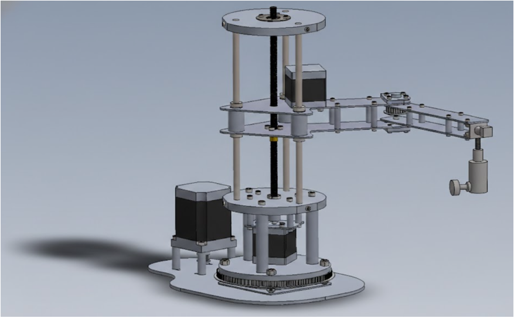
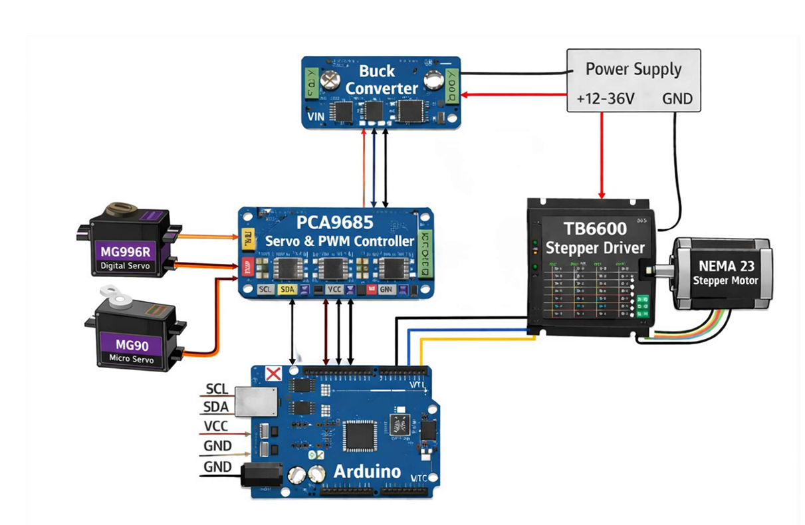
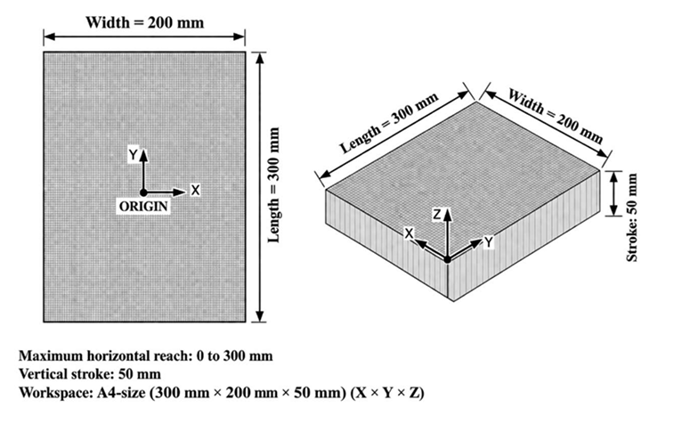

# 🤖 4-DOF SCARA Robot

A **4-Degree-of-Freedom (4-DOF) SCARA Robot** designed and developed for **writing, drawing, and pick-and-place applications**. The robot combines precise planar motion with vertical movement using a stepper motor and servo motors, making it suitable for educational, industrial, and automation tasks.

This project was developed as a **Mini Project** for the **B.Tech in Robotics and Artificial Intelligence** program.

---

## 📖 Project Overview

The robot consists of two revolute joints, one prismatic joint, and one wrist rotation joint, enabling accurate movement in the X-Y plane along with controlled Z-axis motion. The system is controlled using an **Arduino Uno**, **TB6600 Stepper Driver**, and **PCA9685 Servo Driver**.

The project demonstrates concepts of:

- Forward Kinematics
- Inverse Kinematics
- Robot Motion Control
- Embedded Programming
- Mechatronic System Design
- Automation

---

## ✨ Features

- 4 Degrees of Freedom (4-DOF)
- Writing and Drawing Capability
- Pick-and-Place Operation
- Precise X-Y Motion
- Vertical Z-Axis Control
- Wrist Rotation
- Arduino-Based Control
- Modular Mechanical Design
- Cost-Effective Prototype
- Educational Robotics Platform

---

## 🛠️ Hardware Components

| Component | Quantity |
|-----------|----------|
| Arduino Uno | 1 |
| NEMA 23 Stepper Motor | 1 |
| MG996R Servo Motor | 1 |
| MG90S Servo Motor | 1 |
| MG90 Micro Servo | 1 |
| PCA9685 Servo Driver | 1 |
| TB6600 Stepper Driver | 1 |
| Lead Screw Mechanism | 1 |
| 24V Power Supply | 1 |
| DC-DC Buck Converter | 1 |
| Bearings & Shafts | Multiple |
| Forex Sheet Structure | Custom |

---

## 💻 Software Used

- Arduino IDE
- Embedded C/C++
- Inverse Kinematics Algorithms
- Motion Control Programming

---

## 📐 Robot Specifications

| Parameter | Value |
|-----------|--------|
| Degrees of Freedom | 4 |
| Link 1 Length | 140 mm |
| Link 2 Length | 110 mm |
| Vertical Link | 130 mm |
| End Effector Link | 50 mm |
| Horizontal Reach | ~250 mm |
| Vertical Stroke | ~120 mm |

---

## ⚙️ Working Principle

1. User inputs the desired coordinates.
2. Inverse kinematics calculates the required joint angles.
3. Arduino processes the calculated values.
4. Servo motors rotate Joint-1, Joint-2, and the end-effector.
5. Stepper motor controls the vertical Z-axis movement.
6. The robot performs writing, drawing, or pick-and-place operations accurately.

---

## 📂 Repository Structure

```
SCARA-Robot-4DOF/
│
├── README.md
├── LICENSE
│
├── arduino/
│   └── scara_robot.ino
│
├── report/
│   └── Mini-Project-Report.pdf
│
├── documents/
│   └── Presentation.pptx
│
├── hardware/
│   ├── components-list.md
│   └──  wiring-diagram.png
│  
│
├── calculations/
│   ├── DH-Parameters.pdf
│   ├── Torque-Calculations.pdf
│   └── Workspace-Analysis.pdf
│
└── images/
    ├── robot.jpg
    ├── workspace.png
    ├── cad-model.png
    └── circuit.png


```

---

## 📸 Project Images

### 🤖 SCARA Robot


### 🛠️ CAD Design



### 🔌 Circuit Diagram



### 📏 Workspace



---


## 📈 Results

- Successfully performed writing and drawing tasks.
- Achieved smooth X-Y planar movement.
- Controlled vertical motion using a lead screw mechanism.
- Demonstrated accurate end-effector positioning.
- Validated inverse kinematics for coordinated motion.

---

## 🚀 Future Improvements

- ROS2 Integration
- Computer Vision-Based Object Detection
- AI Path Planning
- Voice Command Control
- Mobile Application Control
- Automatic Calibration
- Object Sorting Using AI
- IoT-Based Remote Monitoring

---

## 📚 Skills Demonstrated

- Robotics
- Embedded Systems
- Arduino Programming
- Servo Motor Control
- Stepper Motor Control
- Inverse Kinematics
- Robot Mechanics
- Mechatronics
- CAD Design
- Automation

---

## 👩‍💻 Author

**Fathimath Shana AP**

- B.Tech Robotics and Artificial Intelligence
- GitHub: https://github.com/shanaap85

---

## ⭐ Support

If you found this project interesting, feel free to **star the repository** and explore my other robotics and software development projects.

Thank you for visiting!
